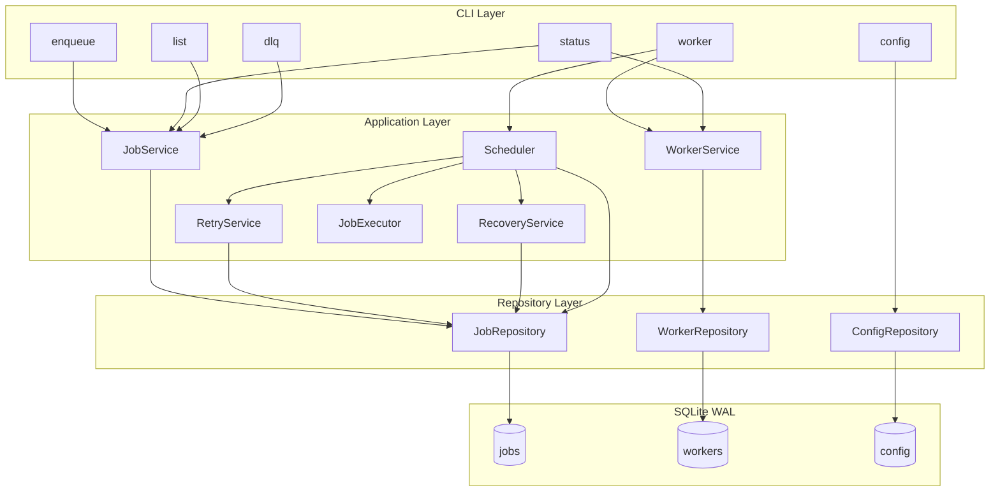
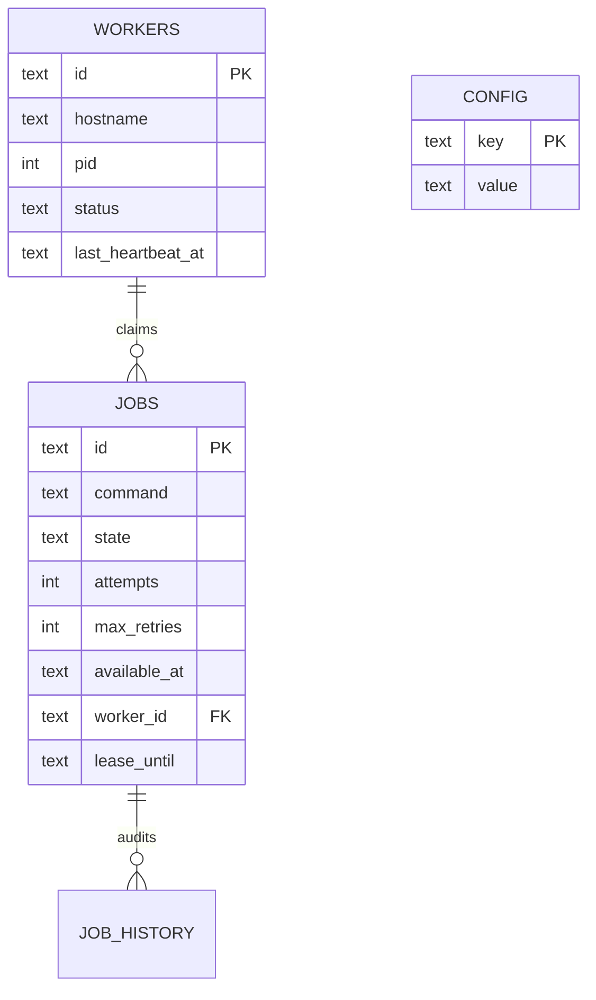
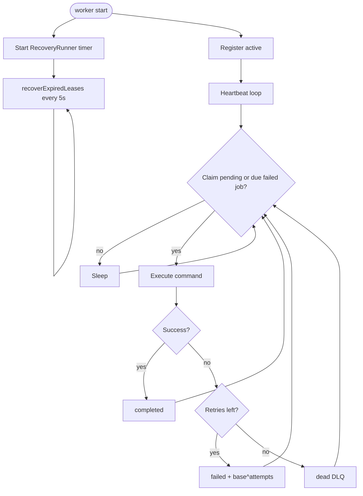
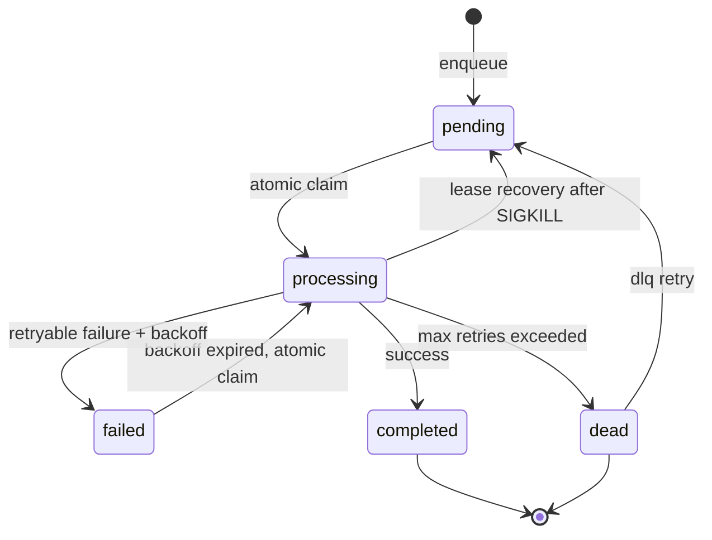
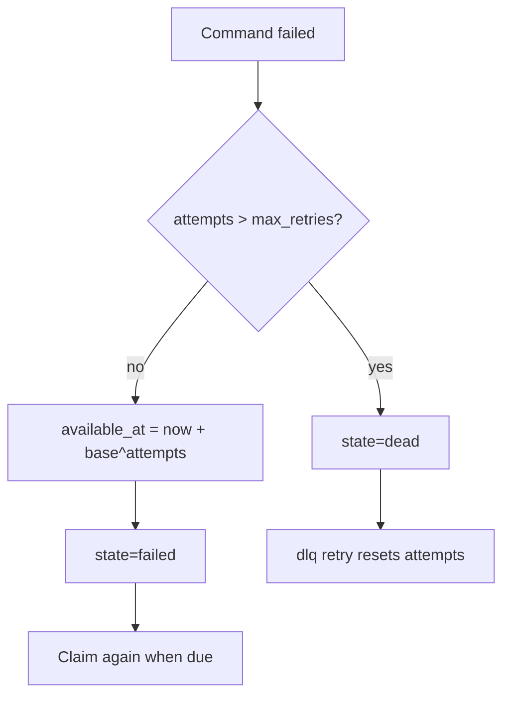
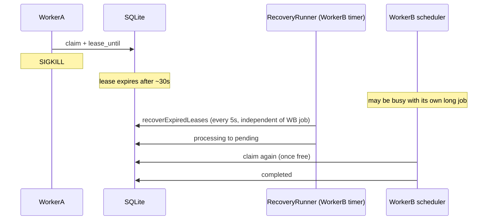
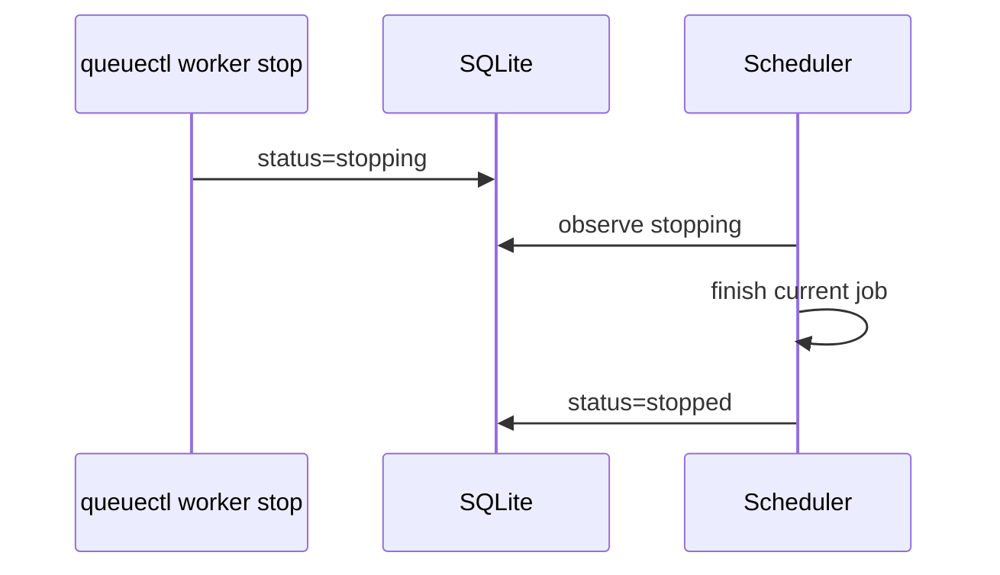
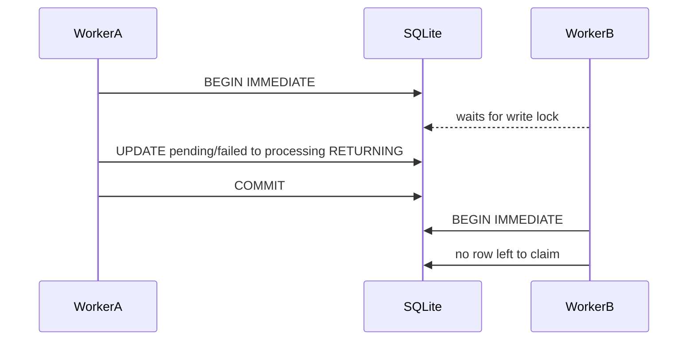
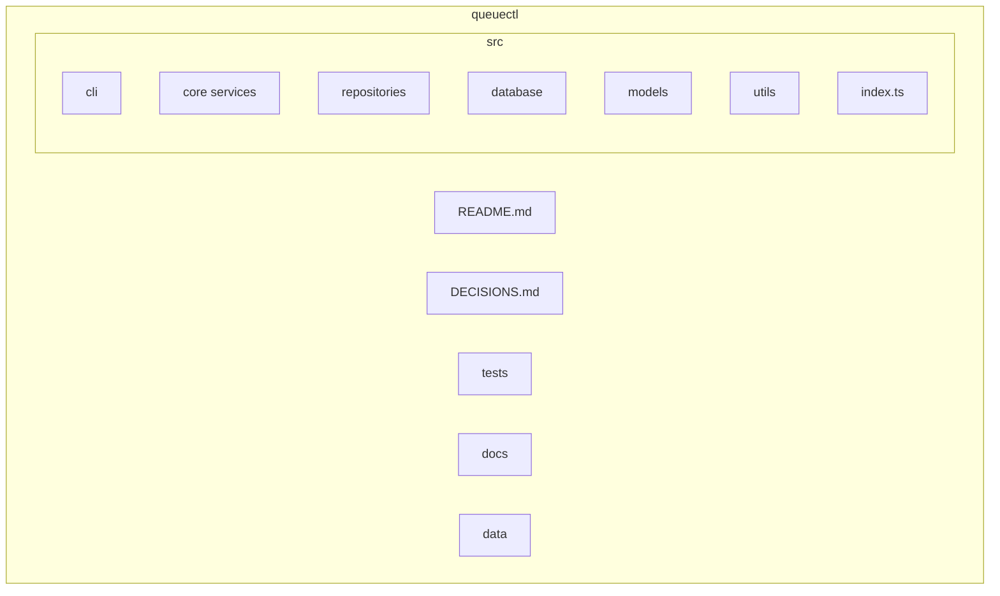

# QueueCTL

Production-inspired CLI background job queue for Node.js.

A miniature of Sidekiq / BullMQ / Celery / SQS workers — durable SQLite storage, multi-worker atomic claiming, retries, dead-letter queue, lease-based crash recovery, and graceful shutdown.

## Setup

```bash
npm install
npm run build
npm link          # exposes `queuectl` on your PATH via dist/index.js
queuectl --help
```

Local development without linking:

```bash
npm run queuectl -- --help
# or
npx tsx src/index.ts --help
```

Database path defaults to `./data/queuectl.sqlite`. Override with `QUEUECTL_DB`.

## Demo recording

> Demo link: [QueuectlDemo.mov](https://drive.google.com/file/d/1odrKU852VPRJ4wwHndpkHI0OAORquIyB/view?usp=sharing)
>
> Suggested demo script: enqueue → `worker start --count 2` → `status` / `list --json` → Ctrl+C drain → `kill -9` recovery (`Stale Job Recovered` log) → `dlq` / `config set`.

## CLI (assignment contract)

```bash
queuectl enqueue '{"id":"job1","command":"echo Hello QueueCTL"}'

queuectl worker start
queuectl worker start --count 3

queuectl worker stop

queuectl status

queuectl list --state pending
queuectl list --state pending --json

queuectl dlq list
queuectl dlq retry job1

queuectl config set max-retries 3
queuectl config set backoff-base 2
queuectl config get
```

`list --json` prints **only** a JSON array to stdout (no logs, headers, or colors). Operational logs always go to stderr.

## Features

- JSON enqueue with client-provided job IDs
- Concurrent workers via `--count` (same OS process) or separate `worker start` terminals (separate OS processes)
- Atomic job claiming (`BEGIN IMMEDIATE`)
- SQLite persistence (WAL mode)
- Exponential backoff: `delay_seconds = backoff-base ^ attempts`
- Dead letter queue + operator retry
- Lease-based crash recovery on an independent timer (~35s at defaults, measured 34.6s)
- Worker heartbeats + lease extension
- Graceful SIGINT/SIGTERM shutdown
- Cooperative `worker stop` from another terminal
- Persistent configuration

## Architecture

Layered clean architecture. Deep-dive diagrams (crash recovery sequence, atomic claim contention, full ER, folder map) live in [docs/architecture.md](./docs/architecture.md).



### Request flow


See [DECISIONS.md](./DECISIONS.md) for claim, lease recovery, and stop-design rationale.

## Database Schema



### `jobs`

| Column | Purpose |
|---|---|
| `id` | Client-provided or generated ID |
| `command` | Shell command string |
| `state` | pending / processing / completed / failed / dead |
| `attempts` / `max_retries` | retry bookkeeping |
| `available_at` | delay gate for retries |
| `worker_id` / `lease_until` | lease ownership |
| timestamps / output fields | audit + execution outcome |

### `workers`

Worker identity, pid, status (`active|stopping|stopped`), heartbeat timestamps.

### `config`

Key/value durable settings. Assignment keys: `max-retries`, `backoff-base`.

### `job_history`

Append-only audit events.

## Worker Lifecycle

The recovery timer is a sibling of the scheduler loop, not a step inside it.



## Job State Machine



## Retry Flow



Example with `backoff-base=2`: attempt 1 → 2s, attempt 2 → 4s, attempt 3 → 8s.

Existing jobs keep their snapshotted `max_retries`. New `config set max-retries` applies to newly enqueued jobs only (unless the enqueue JSON overrides `max_retries`).

## Crash Recovery



Look for stderr: `Job Claimed` → `Stale Job Recovered` → `Job Claimed` → `Job Completed`.

Recovery runs on `RecoveryRunner`'s own timer (`src/core/RecoveryRunner.ts`), one per worker
process, **not** inside the scheduler's claim/execute loop. That is what lets a worker
reclaim a crashed peer's job while it is itself executing a long-running command.

**Detection time** (SIGKILL → job back in `pending`) is bounded by lease expiry plus one
recovery interval: `lease-timeout-ms` (30s) + `recovery-interval-ms` (5s) ≈ **35s** at
defaults, inside the assignment's 60s limit. Measured end-to-end at defaults: **34.6s**,
with the surviving worker 35s into a 90s job.

This bound holds **while at least one worker process is alive**. If every worker is killed
there is no process left to detect the expired lease; the job is recovered as soon as an
operator runs `queuectl worker start` (which recovers immediately on startup) or
`queuectl status`. Re-execution is additionally gated on a free worker, so a job may sit in
`pending` after recovery until some scheduler finishes its current work.

Covered by `tests/crashRecoveryWhilePeerBusy.test.ts` (real processes, real `SIGKILL`,
reports the measured recovery time) and `tests/recoveryRunner.test.ts`.

## Worker Stop



## Atomic Claim



## Configuration

| Key | Default | Meaning |
|---|---|---|
| `max-retries` | `3` | Retry budget snapshotted onto each job at enqueue |
| `backoff-base` | `2` | Seconds delay = `base ^ attempts` |
| `lease-timeout-ms` | `30000` | Job lease; a lease this stale means the owner died |
| `heartbeat-interval-ms` | `5000` | Worker + lease heartbeat cadence |
| `recovery-interval-ms` | `5000` | Independent recovery timer; detection ≈ lease + this |
| `poll-interval-ms` | `1000` | Idle poll sleep |
| `output-truncate-bytes` | `8192` | Captured stdout/stderr cap per job |

```bash
queuectl config set max-retries 3
queuectl config set backoff-base 2
queuectl config get
```

## Testing

```bash
npm test
npm run typecheck
```

`npm test` includes black-box CLI tests that spawn real `queuectl worker start` processes
and send `SIGKILL`. Those tests need permission to manage process groups (they fail under
a tight sandbox with a timeout waiting for a worker to claim a job).

## Assumptions

- Single-machine deployment sharing one SQLite file (not a multi-region cluster).
- Job payloads are shell command strings executed with `shell: true`.
- Operators trust the host; there is no command sandbox or auth layer.
- Demo recording is provided separately via the Demo link above.
- Automated graders parse `list --json` from **stdout only**; logs go to stderr.

## Limitations

- SQLite write lock limits multi-worker throughput (by design for this assignment).
- Crash recovery is **at-least-once**: a job may run again after SIGKILL. Commands should be
  idempotent — a killed worker's child process is not itself reaped by QueueCTL, so work
  already performed before the crash is not undone. A bare `kill -9 <pid>` orphans the
  shell child; `kill -- -<pgid>` reaps the group.
- Recovery requires a live worker process. With every worker dead, detection waits for the
  next `worker start` or `status`; there is no standalone recovery daemon by design.
- `worker stop` is cooperative (DB flag), not instant remote kill.
- Automatic retries park in `failed` with a future `available_at` (the assignment's
  "failed, but will be retried" state). Crash recovery resets to `pending`, not `failed`,
  because a SIGKILL is not a command failure.
- Not a distributed queue; Redis/NATS would be needed for multi-host workers.
- No web dashboard in this submission.

## Project Structure



```text
src/
  cli/           # Commander commands + formatting
  core/          # Job/Worker/Retry/Recovery/Scheduler/Executor
  repositories/  # SQL access
  database/      # connection, schema, migrations
  models/        # domain types + row mappers
  utils/         # logger, backoff, signals, time, ids
  types/         # shared unions
tests/
docs/
README.md
DECISIONS.md
```
