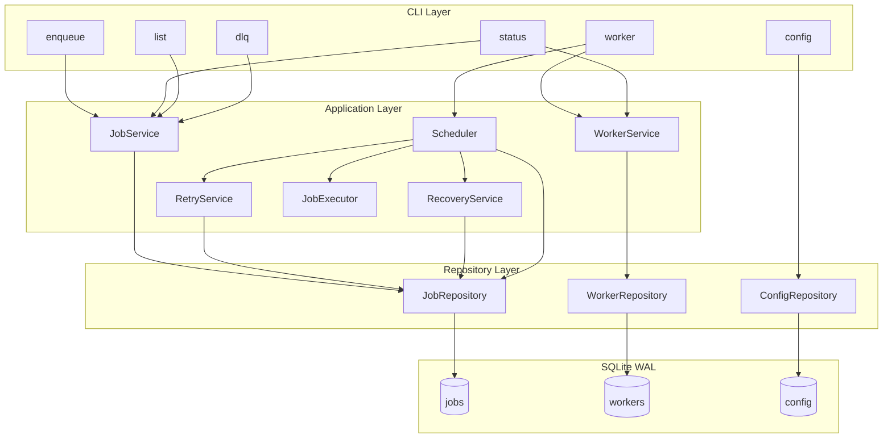
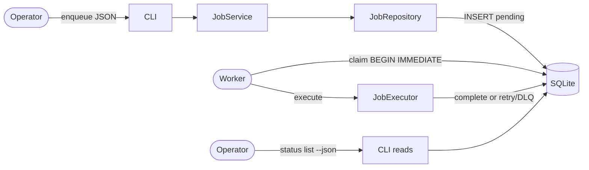
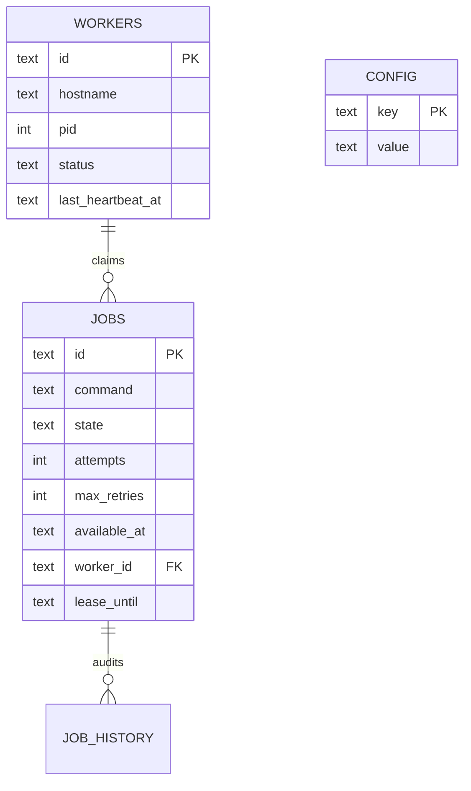
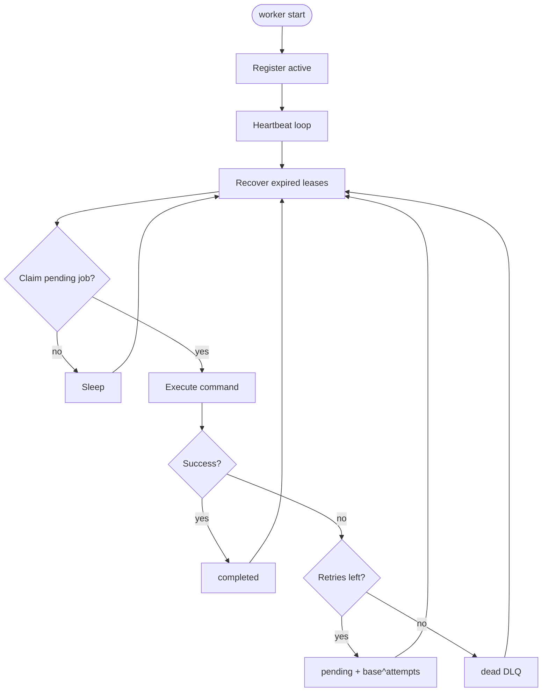
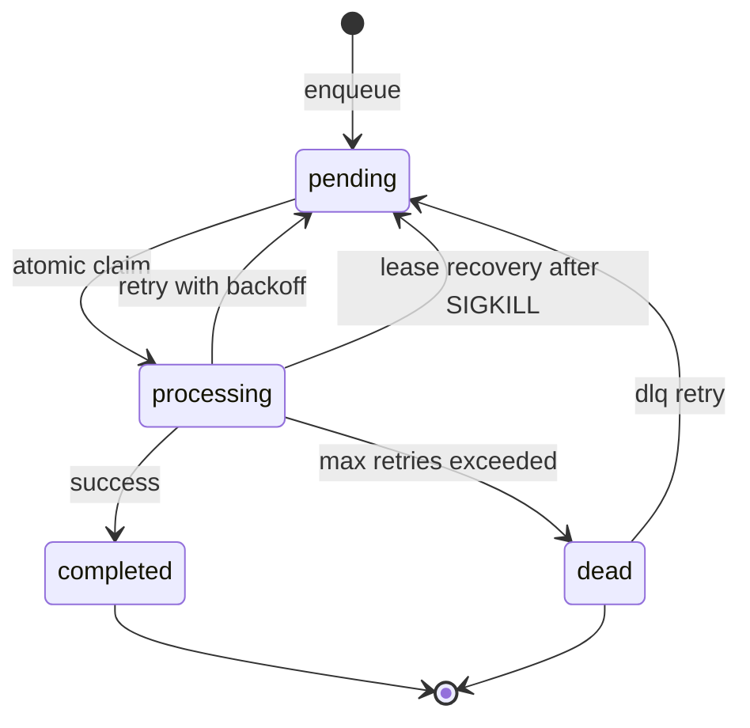
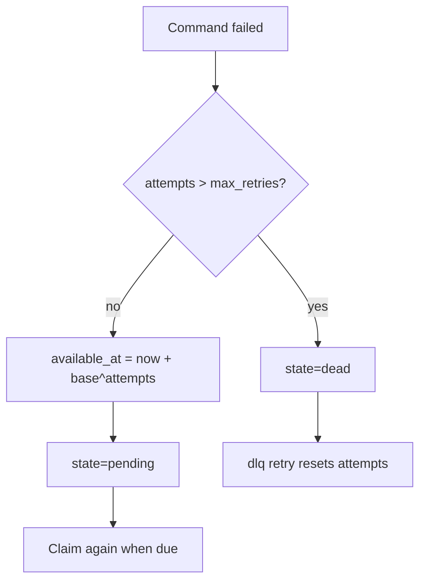
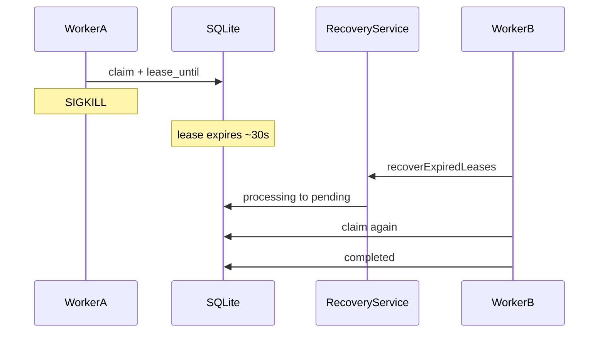
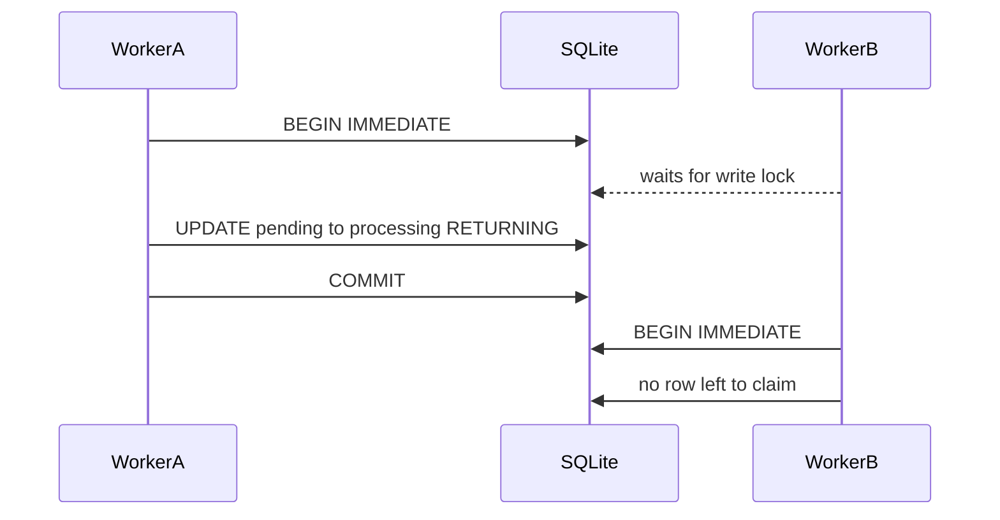
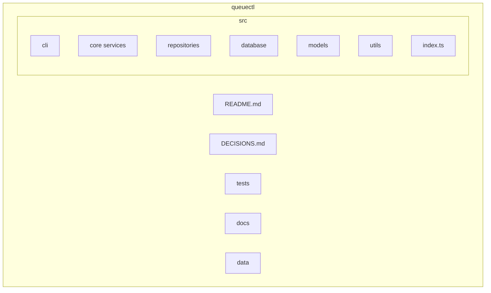

# QueueCTL

Production-inspired CLI background job queue for Node.js.

A miniature of Sidekiq / BullMQ / Celery / SQS workers — durable SQLite storage, multi-worker atomic claiming, retries, dead-letter queue, lease-based crash recovery, and graceful shutdown.

## Setup

```bash
npm install
npm run build
npm link          # exposes `queuectl` on your PATH via dist/index.js
queuectl --help
```

Local development without linking:

```bash
npm run queuectl -- --help
# or
npx tsx src/index.ts --help
```

Database path defaults to `./data/queuectl.sqlite`. Override with `QUEUECTL_DB`.

## Demo recording

> **TODO:** Replace this with your uploaded demo URL (YouTube / Google Drive / Loom).
>
> Demo link: _<add recording URL before submission>_
>
> Suggested demo script: enqueue → `worker start --count 2` → `status` / `list --json` → Ctrl+C drain → `kill -9` recovery (`Stale Job Recovered` log) → `dlq` / `config set`.

## CLI (assignment contract)

```bash
queuectl enqueue '{"id":"job1","command":"echo Hello QueueCTL"}'

queuectl worker start
queuectl worker start --count 3

queuectl worker stop

queuectl status

queuectl list --state pending
queuectl list --state pending --json

queuectl dlq list
queuectl dlq retry job1

queuectl config set max-retries 3
queuectl config set backoff-base 2
queuectl config get
```

`list --json` prints **only** a JSON array to stdout (no logs, headers, or colors). Operational logs always go to stderr.

## Features

- JSON enqueue with client-provided job IDs
- Concurrent workers via `--count`
- Atomic job claiming (`BEGIN IMMEDIATE`)
- SQLite persistence (WAL mode)
- Exponential backoff: `delay_seconds = backoff-base ^ attempts`
- Dead letter queue + operator retry
- Lease-based crash recovery (< 60s worst case with defaults)
- Worker heartbeats + lease extension
- Graceful SIGINT/SIGTERM shutdown
- Cooperative `worker stop` from another terminal
- Persistent configuration

## Architecture

Layered clean architecture. Deep-dive diagrams (crash recovery sequence, atomic claim contention, full ER, folder map) live in [docs/architecture.md](./docs/architecture.md).



### Request flow



See [DECISIONS.md](./DECISIONS.md) for claim, lease recovery, and stop-design rationale.

## Database Schema



### `jobs`

| Column | Purpose |
|---|---|
| `id` | Client-provided or generated ID |
| `command` | Shell command string |
| `state` | pending / processing / completed / failed / dead |
| `attempts` / `max_retries` | retry bookkeeping |
| `available_at` | delay gate for retries |
| `worker_id` / `lease_until` | lease ownership |
| timestamps / output fields | audit + execution outcome |

### `workers`

Worker identity, pid, status (`active|stopping|stopped`), heartbeat timestamps.

### `config`

Key/value durable settings. Assignment keys: `max-retries`, `backoff-base`.

### `job_history`

Append-only audit events.

## Worker Lifecycle



## Job State Machine



## Retry Flow



Example with `backoff-base=2`: attempt 1 → 2s, attempt 2 → 4s, attempt 3 → 8s.

Existing jobs keep their snapshotted `max_retries`. New `config set max-retries` applies to newly enqueued jobs only (unless the enqueue JSON overrides `max_retries`).

## Crash Recovery



Look for stderr: `Job Claimed` → `Stale Job Recovered` → `Job Claimed` → `Job Completed`.

Default worst case: **~30 seconds** (`lease-timeout-ms=30000`), under the 60s assignment maximum.

## Worker Stop

```mermaid
sequenceDiagram
  participant CLI as queuectl worker stop
  participant DB as SQLite
  participant S as Scheduler

  CLI->>DB: status=stopping
  S->>DB: observe stopping
  S->>S: finish current job
  S->>DB: status=stopped
```



## Atomic Claim



## Configuration

| Key | Default | Meaning |
|---|---|---|
| `max-retries` | `3` | Retry budget snapshotted onto each job at enqueue |
| `backoff-base` | `2` | Seconds delay = `base ^ attempts` |
| `lease-timeout-ms` | `30000` | Job lease / crash recovery window (~30s worst case) |
| `heartbeat-interval-ms` | `5000` | Worker + lease heartbeat cadence |
| `poll-interval-ms` | `1000` | Idle poll sleep |

```bash
queuectl config set max-retries 3
queuectl config set backoff-base 2
queuectl config get
```

## Testing

```bash
npm test
npm run typecheck
```

## Assumptions

- Single-machine deployment sharing one SQLite file (not a multi-region cluster).
- Job payloads are shell command strings executed with `shell: true`.
- Operators trust the host; there is no command sandbox or auth layer.
- Demo recording is provided separately via the Demo link above.
- Automated graders parse `list --json` from **stdout only**; logs go to stderr.

## Limitations

- SQLite write lock limits multi-worker throughput (by design for this assignment).
- Crash recovery is **at-least-once**: a job may run again after SIGKILL.
- `worker stop` is cooperative (DB flag), not instant remote kill.
- Automatic retries use `pending` + `available_at` rather than parking in `failed` (see DECISIONS.md).
- Not a distributed queue; Redis/NATS would be needed for multi-host workers.
- No web dashboard in this submission.

## Project Structure



```text
src/
  cli/           # Commander commands + formatting
  core/          # Job/Worker/Retry/Recovery/Scheduler/Executor
  repositories/  # SQL access
  database/      # connection, schema, migrations
  models/        # domain types + row mappers
  utils/         # logger, backoff, signals, time, ids
  types/         # shared unions
tests/
docs/
README.md
DECISIONS.md
```
