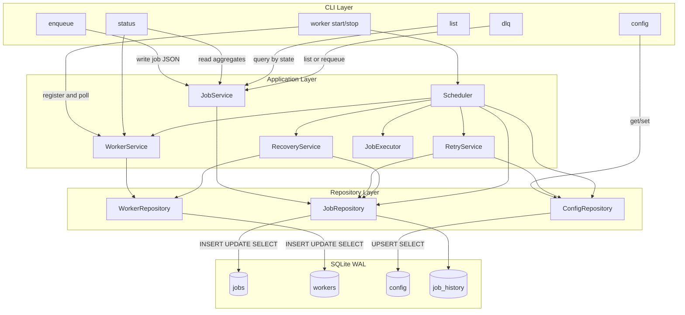
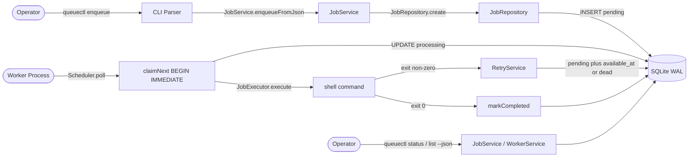
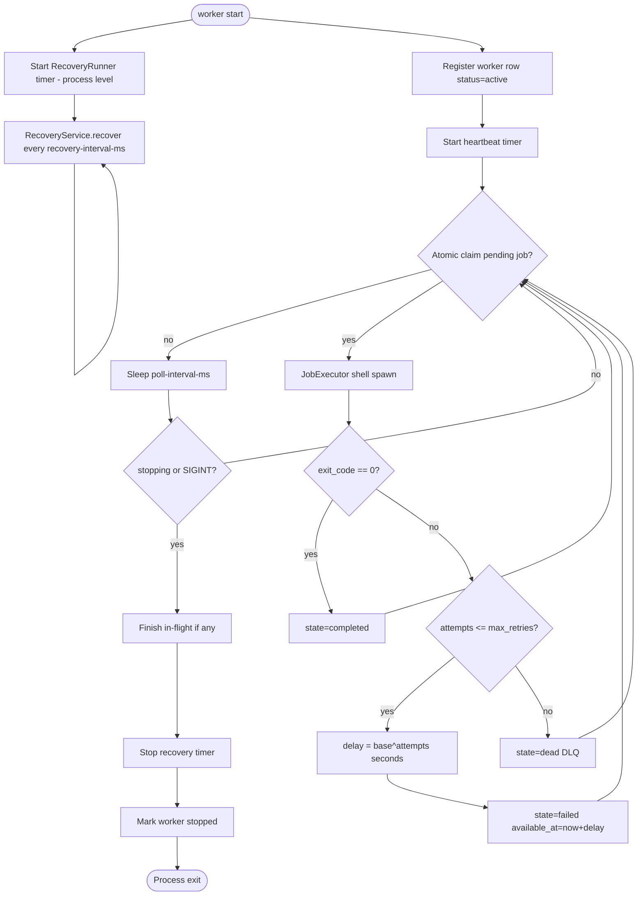
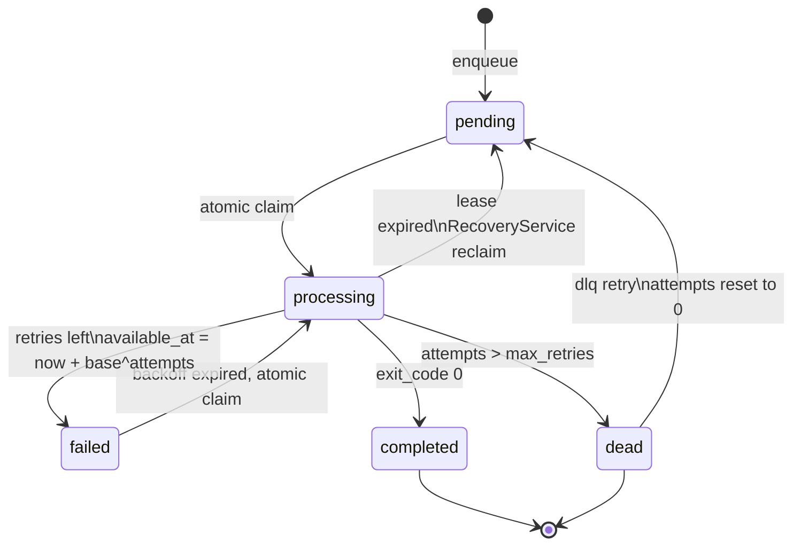
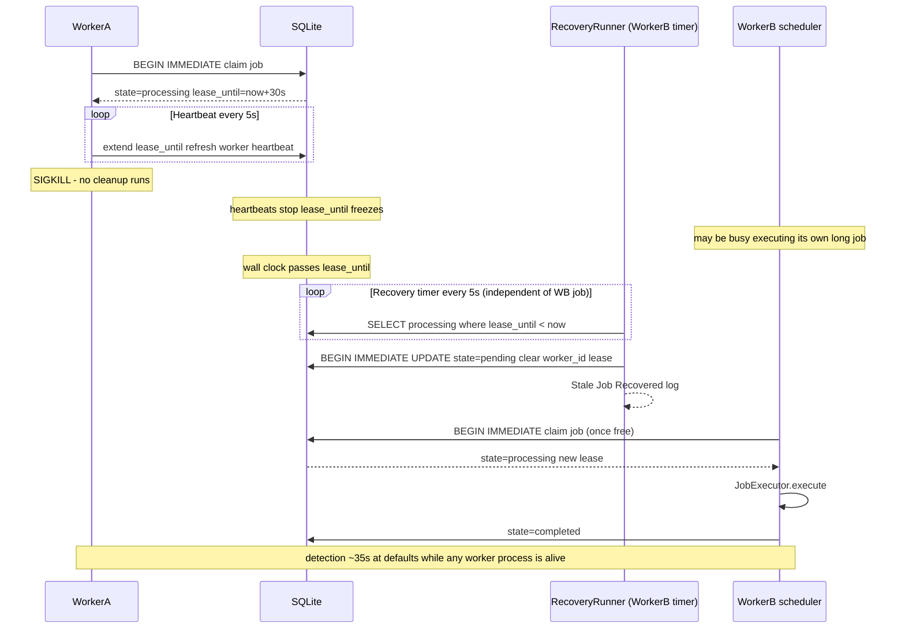
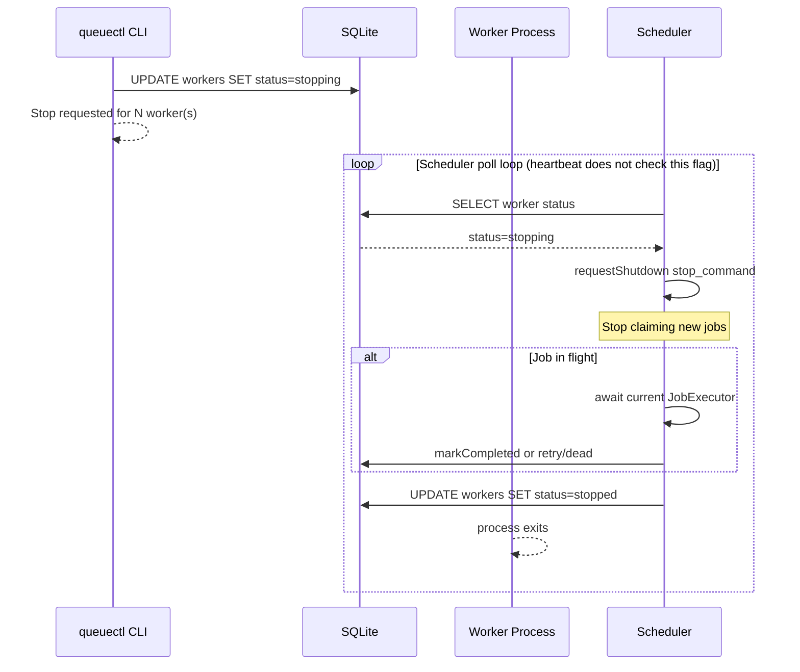
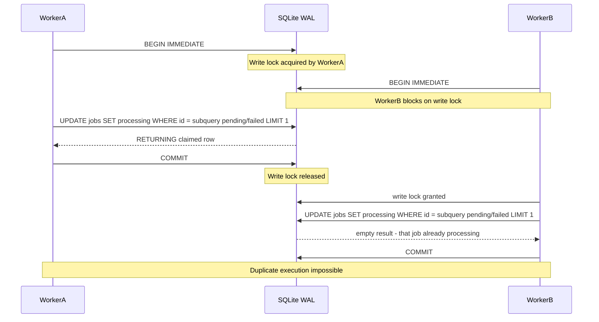
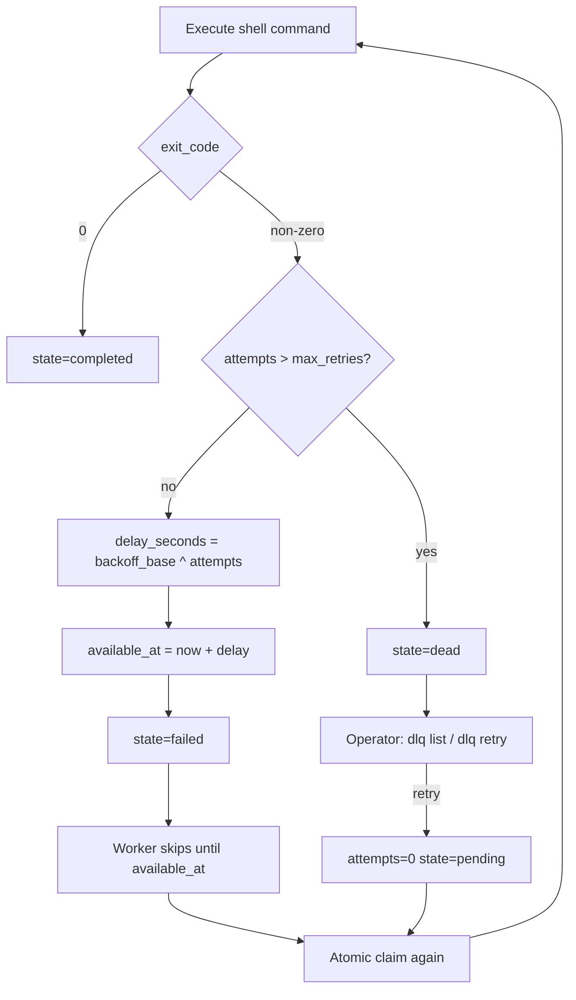
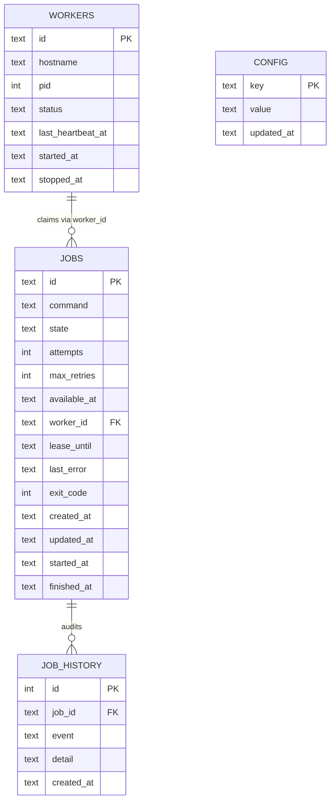
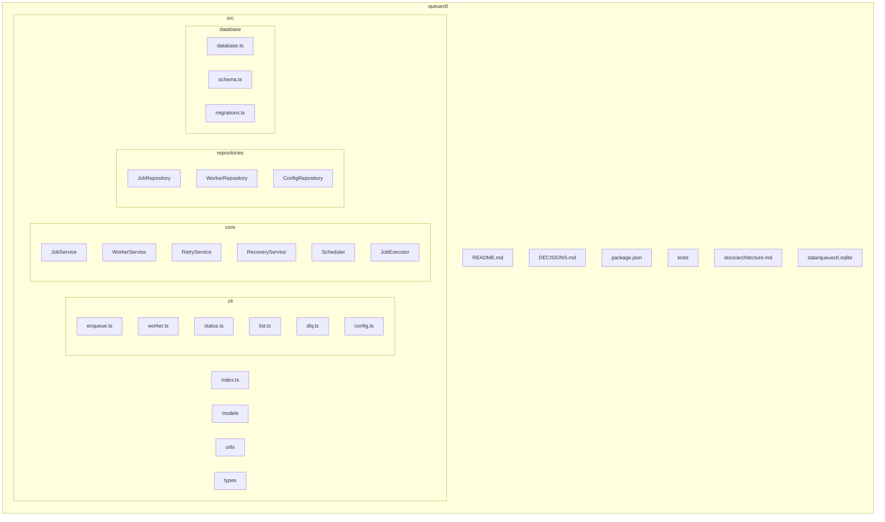

# QueueCTL Architecture

Deep-dive diagrams for interview and code review. High-level overview also lives in [README.md](../README.md).

---

## 1. Layered System Architecture



Dependency rule: CLI → Application → Repository → Database. SQL never leaves the repository layer.

---

## 2. End-to-End Request Flow



---

## 3. Worker Lifecycle

The recovery timer is a sibling of the scheduler loop, not a step inside it. Both live in
the same worker process; only the scheduler loop blocks on job execution.



---

## 4. Job State Machine



Notes:
- Automatic retries park in `failed` with a future `available_at` — the assignment's "failed, but will be retried" state.
- Crash recovery resets to `pending` because a SIGKILL is not a command failure.

---

## 5. Crash Recovery Sequence

Recovery runs on `RecoveryRunner`'s own timer inside each worker process, not in the
scheduler's claim/execute loop. That is what lets Worker B reclaim Worker A's job while
B is itself busy executing a long command.



Detection (`kill` → `state=pending`) is bounded by lease expiry plus one recovery
interval: 30s + 5s at defaults. Measured end-to-end at defaults: **34.6s**, with the peer
worker 35s into a 90s job. Re-execution then waits for a free scheduler, so completion is
later than detection whenever every worker is busy.

The bound holds only while at least one worker **process** is alive. If every worker is
killed, nothing is running to detect the expired lease; the job stays `processing` until
an operator runs `queuectl worker start` (which recovers immediately on startup) or
`queuectl status` (`src/cli/status.ts:27`).

---

## 6. Worker Stop Sequence



---

## 7. Atomic Claim Under Contention



Claim SQL (conceptual):

```sql
BEGIN IMMEDIATE;
UPDATE jobs
SET state = 'processing', worker_id = ?, lease_until = ?, attempts = attempts + 1
WHERE id = (
  SELECT id FROM jobs
  WHERE state IN ('pending', 'failed') AND available_at <= ?
  ORDER BY created_at ASC
  LIMIT 1
)
RETURNING *;
COMMIT;
```

---

## 8. Retry and Backoff Flow



Example with `backoff-base=2`: attempt 1 → 2s, attempt 2 → 4s, attempt 3 → 8s.

---

## 9. Database ER Diagram



Lease and scheduling hot fields: `jobs.lease_until`, `jobs.available_at`, `jobs.attempts`, `jobs.state`, `workers.last_heartbeat_at`.

---

## 10. Project Structure



Physical layout mirrors clean architecture: CLI commands stay thin; domain rules live in `core`; SQL lives in `repositories`.
